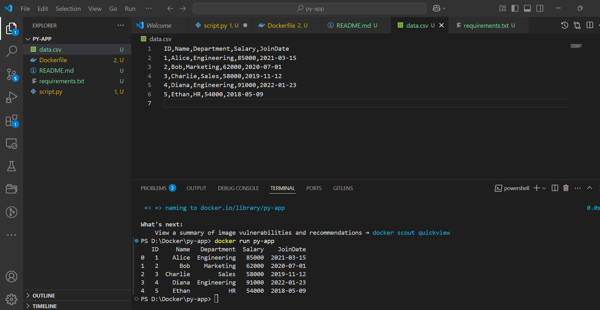
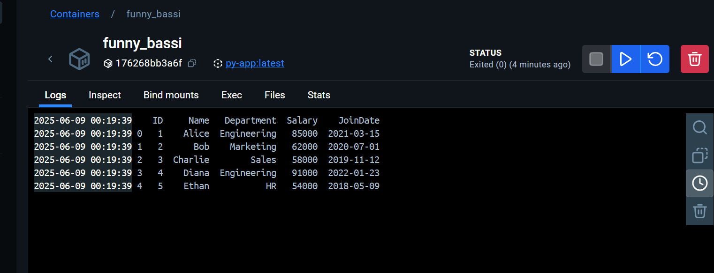

# Python Dockerized CSV Reader

This project demonstrates how to use Docker to containerize a simple Python application that reads and displays data from a CSV file using the `pandas` library.

## demo



## Project Structure

- `script.py`: Python script that reads `data.csv` and prints its contents.
- `data.csv`: Sample CSV file containing employee data.
- `requirements.txt`: Lists Python dependencies (currently only `pandas`).
- `Dockerfile`: Multi-stage Dockerfile to build and run the application in a minimal image.

## How It Works

1. The Dockerfile uses a multi-stage build:
    - **Build Stage:** Installs dependencies and copies the application files.
    - **Run Stage:** Copies only the necessary files and dependencies to a smaller image for execution.
2. When the container runs, it executes `script.py`, which loads `data.csv` and prints the first few rows.

## Usage

### Build the Docker Image

```sh
docker build -t python-csv-app .
```

### Run the Docker Container

```sh
docker run --rm python-csv-app
```

You should see the contents of `data.csv` printed in the console.

## Example Output

```
   ID    Name   Department  Salary    JoinDate
0   1   Alice  Engineering   85000  2021-03-15
1   2     Bob    Marketing   62000  2020-07-01
2   3 Charlie         Sales   58000  2019-11-12
3   4   Diana  Engineering   91000  2022-01-23
4   5   Ethan            HR   54000  2018-05-09
```

## Requirements

- Docker

## License

This project is for demonstration purposes.